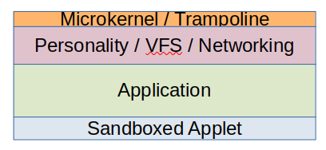

## Future Trampoline Microkernel

It has previously been mentioned that the microkernel has a relatively large API
compared to some modern microkernels. A long-term goal is to split the microkernel
and make it run on a minimal "trampoline microkernel" that implements virtual
protection rings.

In this model the operating system is structured as a series of rings, the core
running in rings with more privilege and applications and sandboxes running with
less privileges.

The diagram below shows a 3-level design with the Personality, application and
sandboxed application. The personality would implement what is in the current
microkernel. That is it would implement processes, memory management, scheduling and
the VFS. 

Applications would run as separate processes but would have the option
to create subprocesses that can call into the application. In this way and
application can act as a reference monitor or pseudo virtual machine.

The personality could be split into rings for Processes/scheduling (executive),
networking and filesystem.

The microkernel is merely trampoline, similar to how kernel-pagetable-isolation (KPTI)
works. This only implements:

    - "call" and "reply" system calls, to transfer call into and return from a protection ring
    - interrupt dispatching to a function in a specific ring and "iret" system call
    - exception handler redirection to a specific ring and "fret" system call
    - Optional copyin, copyout and copyinstr system calls to copy data from a less privileged ring.

It is estimated that the code size could be less than 2 kilobytes.

