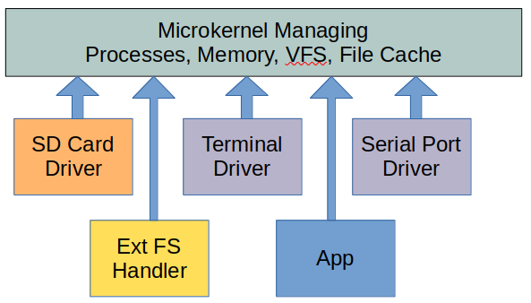

# Inter-Process Communication (IPC)

The cheviot microkernel handles the core services of the operating system.
The microkernel handles processes, memory, scheduling and the upper layers
of the virtual file system. Device drivers and specific file system handlers
run as separate processes. The microkernel creates messages and sends these
to file system handlers and device drivers as and when needed.

Within the microkernel the virtual file system supports a file-level cache
and directory name lookup cache. The common case of reading a file that
is already in the cache avoids the expense of sending messages to file system
handlers and device drivers.




# Interprocess Communication and Drivers

Client applications do not send messages directly to file systems or drivers.
Instead traditional system calls such as open, read and write are first processed
by the microkernel.  If a file is cached within the kernel these calls can complete
without any IPC to the file system or drivers.  If the system call must fetch
data from the device it converts it to a message which is sent to a handler server
that translates the layout of a particular file system. A file system handler will
then send messages to a block device driver to read and write the physical blocks
of the device.

A device driver or file system handler both act as servers.  They both register a
message port with the kernel's VFS using the mount() system call. File system handlers
create a mount point on an existing directory and handle the namespace below this
mount point. Block and character device drivers mount onto a block or character device
file, usually located in the "/dev" directory.

Several system calls are used by the servers to handle messages and one internal function
within the kernel to send messages to a server. We will begin by describing the ksendmsg
used within the kernel.

## ksendmsg

```
int ksendmsg(struct MsgPort *port, int siov_cnt, struct IOV *siov,
             int riov_cnt, struct IOV *riov);
```

As mentioned earlier the kernel converts standard file system operations such as open,
read, write and readdir into messages that it sends onto a server.  Internally this is
done through a function named ksendmsg and is not exposed to the user directly.

In ksendmsg, two arrays containing IOV are used.  These are 2 field structures containing
an address and size. This is for handling multi-part messages where we we point to a message
header in the first IOV and the associated data in any following IOVs. The siov array is
for any data we are "sending" to the server and the riov is for pointing to where data we
receive from a server will go.

## mount


## kevent

```
int kevent(int fd, const struct kevent *changelist, int nchanges,
               struct kevent *eventlist, int nevents, 
               const struct timespec *_timeout)
```
CheviotOS supports a kqueue/kevent mechanism to detect when new messages arrive at a message
port. In most cases kevent waits for a message to arrive and places details into a kevent
structure. A server can use this to determine which message port fetch and process messages
from. Kevent can also take a timeout parameter should the server need to periodically
wake up and perform other tasks.


## getmsg

```
int getmsg(int fd, msgid_t *msgid, iorequest_t *req_buf, size_t req_buf_sz);
```

This is a non-blocking call, This retrieves the first message if any from the
mount point's message port or returns immediately if no message is waiting.
It optionally can read some of the message into a buffer, this is usually used
to read the message's header.

Each message received with getmsg will be assigned a unique msgid based on the
sending thread's thread ID. This allows a server to concurrently handle multiple
messages and process them out of order.  The msgid is used when performing
operations on the message such as readmsg and writemsg and replymsg.

## replymsg

```
int sys_replymsg(int fd, msgid_t msgid, int status, ioreply_t *reply, size_t reply_sz);
```

This is used to reply to a message that has already been received by getmsg.
Optionally a status code can be returned in addition to optional reply data.

## readmsg

```
int readmsg(int fd, msgid_t msgid, void *addr, size_t buf_sz, off_t offset);
```

This is used to read additional data from a message that is not in the header.
Examples include filename strings or file data to write to disk.  The offset
specifies where in the senders "siov" IOVs the data should be read from.
The offset is usually specified as "sizeof(struct fsreq)" to read additional
data beyond the fsreq header.

## writemsg

```
int writemsg(int fd, msgid_t msgid, void *addr, size_t buf_sz, off_t offset);
```

This is used to write additional data in a reply to the VFS that is not in the
reply-header sent by replymsg. Examples could be a list of filenames in response
to a readdir command or the data from a command to read a file. The offset
specifies where in the senders "riov" IOVs the data should be written to. The offset
is usually specified as "sizeof(struct fsreply)" to write additional data beyond
the fsreply reply header.


# Example File System Handler Event Loop

The example below shows a simple file system handler based on the IFS code.
It first creates a mount point on top of an existing directory.  It opens the
underlying block device for reading and writing.

The event loop uses kevent() to receive notifications of any pending messages
on the mount's message port. The code calls getmsg to receive the message's
header to determine the command. From this it determines which function to call
in order to process a particular command.

Note that kevent can wait on multiple sources of events, for example in some
drivers it may be useful to wait on interrupts at the same time as messages
coming from a mount's message port. It can also be used to wait on multiple
mount message ports if the driver supports multiple units.


```
  mknod2("/media/mymount", flags, &stat);
  
  portid = createmsgport("/media/mymount", 0, &stat);
  block\_fd = open("/dev/sdcard0p1", O_RDWR);  

  iorequest\_t req;
  int rc;
  int nevents;
  struct kevent ev;
  msgid_t msgid;
    
  EV\_SET(&ev, portid, EVFILT\_MSGPORT, EV\_ADD | EV\_ENABLE, 0, 0, 0); 
  kevent(kq, &ev, 1,  NULL, 0, NULL);

  while (1) {
    errno = 0;
    nevents = kevent(kq, NULL, 0, &ev, 1, NULL);
  
    if (nevents == 1 && ev.ident == portid && ev.filter == EVFILT\_MSGPORT) {
      while ((rc = getmsg(portid, &msgid, &req, sizeof req)) == sizeof req) {
        switch (req.cmd) {
          case CMD_LOOKUP:
            fs_lookup(msgid, &req);
            break;
          
          case CMD_CLOSE:
            fs_close(msgid, &req);
            break;
          
          case CMD_STRATEGY:
            fs_strategy(msgid, &req);
            break;

          case CMD_READDIR:
            fs_readdir(msgid, &req);
            break;

          default:
            exit(-1);
        }
      }
    }
  }
```

## Processing Messages

When processing a message the server can read additional data from the message
using readmsg and write data back to the kernel's VFS with writemsg. Once the
message has been handled the server calls replymsg to inform the VFS of the
result.

```
void fs\_lookup(int msgid, struct fsreq *req)
{
  struct fs\_inode *dir\_node;
  struct fs\_inode *node;
  struct ioreply\_t reply;
  char name[256];
  uint8_t block\_buf[512];
  int status;
  
  // Read the filename that follows after the fsreq header    
  readmsg(portid, msgid, name, req->args.lookup.name\_sz, 0);

  // Lookup the inode for filename
  // ... 

  // Send the reply to the VFS in the kernel    
  reply.args.lookup.inode\_nr = node->inode\_nr;
  reply.args.lookup.size = node->file\_size;
  reply.args.lookup.mode = node->permissions;
  reply.args.lookup.uid = 0;
  reply.args.lookup.gid = 0;
  status = 0;
  
  replymsg(portid, msgid, status, &reply, sizeof reply);
}
```


## Block Devices

Block devices follow a similar pattern to file systems except they register
themselves as block devices in the mount() command and have a smaller set
of commands dealing with reading and writing blocks.

Block devices are mounted on top of block special files created by mknod2.


## Character Devices

Character devices are also similar to file systems, except they have
a special case for handling simultaneous reads and writes. In the kernel
3 commands can be issued to a character device simultaneously, 1 read
command, 1 write command and 1 control command. If there is more than
this then they are queued.

Each command sent to the character device driver has a different
msgid. As messages don't have to be replied to in the order they are
received the msgid provides a way to handle multiple messages from a
mount point's message port.

In the Aux UART and Serial driver we see this in conjunction with Libtask
coroutines. This uses Dijkstra's secretaries and directors model
of coooperating sequential processes. The main task which we call the secretary
listens for incoming messages using kevent, much like a switchboard or front
desk. The secretary task uses getmsg to get the message header. From there
the secretary passes the message header onto directory tasks that perform
the reads and writes. The directors can block while the secretary
task waits for further messages to arrive.

For a deeper understanding of the coroutine model of secretaries and
directors see Dijkstra's paper EWD310, Hierarchical Ordering of Sequential Processes
at [https://www.cs.utexas.edu/users/EWD/transcriptions/EWD03xx/EWD310.html](https://www.cs.utexas.edu/users/EWD/transcriptions/EWD03xx/EWD310.html)

Similar to how block devices mount on top of block special files, the character
devices are mounted on top of character special files created with mknod2.

## Interrupts and Events

Waiting for events using kevent can be interrupted by interrupts. In which case -1
is return and errno set to EINTR. Interrupts are registered with the 
addinterruptserver system call.  Interrupts can also be waited for using
cthread\_event\_wait.  See the Aux UART driver for an example.

## Signals and Aborts

It is sometimes required that a long running request of a server be interrupted. for
example and read from serial port with no data needs to be interrupted due to a SIGTERM
signal to the client process reading from the serial port.  This is under development.

## Notifications

Sometimes it is necessary for drivers to signal asynchronously to the VFS that
some event has occurred.  For example a terminal may need to send a signal
immediately such as SIGTERM to a client process when a key combination is entered.

signalnotify() is used to send a signal to a controlling terminal.

```
int sys_signalnotify(int fd, int ino_nr, int signal);
```

knotei() is used to add a knote to a kqueue for a particular inode.

```
int sys_knotei(int fd, int ino_nr, long hint);
```

## SendMsg

The sendmsg system call is a general purpose blocking send and receive function for sending
arbitrary data to a server.  The subclass defines the message class, for example plain text,
xml or binary messages for specific server types such as GPIO or Mailbox servers.
The message sent to a server and the receiving buffer are both defined using and array
of msgiov_t that define buffer addresses and sizes.

```
int sendmsg(int fd, int subclass, int siov_cnt, msgiov_t *_siov, 
            int riov_cnt, msgiov_t *_riov);
```

## Say Command

Sendmsg can be thought of as an 'enhanced' ioctl mechanism. From the shell command line
the "say" command can be used to send plain text commands to drivers.

For example:

```
$ say /dev/sda "profiling enable"
OK
$ say /dev/sda "profiling stats"

<A list of stats from the driver are printed>

```


